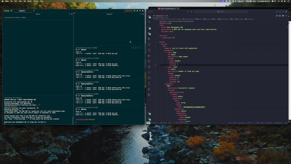

# Mock API Generation

[](https://youtu.be/yrf4eBUw5Yk)

This project is a Python script using Langchain that generates a dinamic mock API based on an OpenAPI specification file. The script uses the Anthropic API to generate the infrastructure required for the API as well as the code for the lambda handlers.

Please not that the project is only a proof of concept and it is not intended to be used in production.

_*For a comprehensive guide on how to generate a dynamic mock API [click here](https://nico.bistol.fi/blog/generative-ai-dynamic-mock-api)*_

## Requirements
* The script requires Python 3.10 or higher.
* NPM is used to install the dependencies for deployment with Serverless Framework.
* Serverless Framework is used to deploy the to AWS Gateway API and AWS Lambda.

## Env file
Copy the .env.example file to .env and fill in the required variables.

The file should contain the following variables:
```
AWS_ACCESS_KEY_ID=<your_aws_access_key_id>
AWS_SECRET_ACCESS_KEY=<your_aws_secret_access_key>
ANTHROPIC_API_KEY=<your_anthropic_api_key>
```

## Running the script

1 - Clone the repository
`git clone https://github.com/daniel-herrera/mock-api-generation.git`

2 - Create virtual environment annd activate it
```bash
python3 -m venv myenv
source myenv/bin/activate
```

3 -Activate virtual environment

Install requirements
```bash
pip install -r requirements.txt
```
4 - Make any modifications to `input/openapi.yml` to your needs

5 - Run the script
```bash
python3 main.py --input input/openapi.yml
```

_*For a comprehensive guide on how to generate a dynamic mock API [click here](https://nico.bistol.fi/blog/generative-ai-dynamic-mock-api)*_
